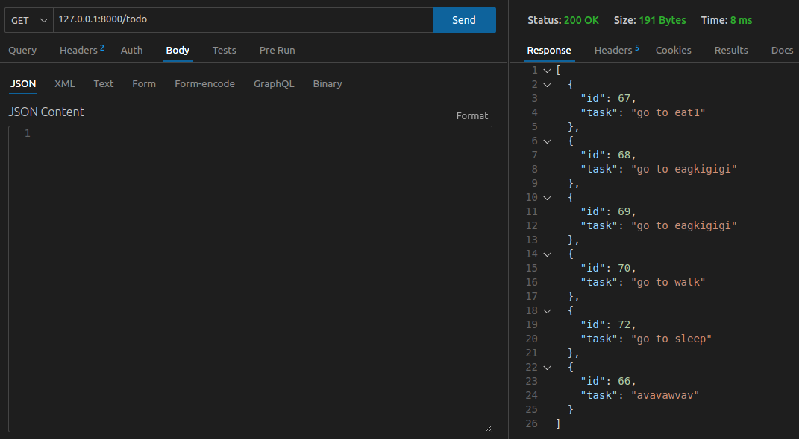
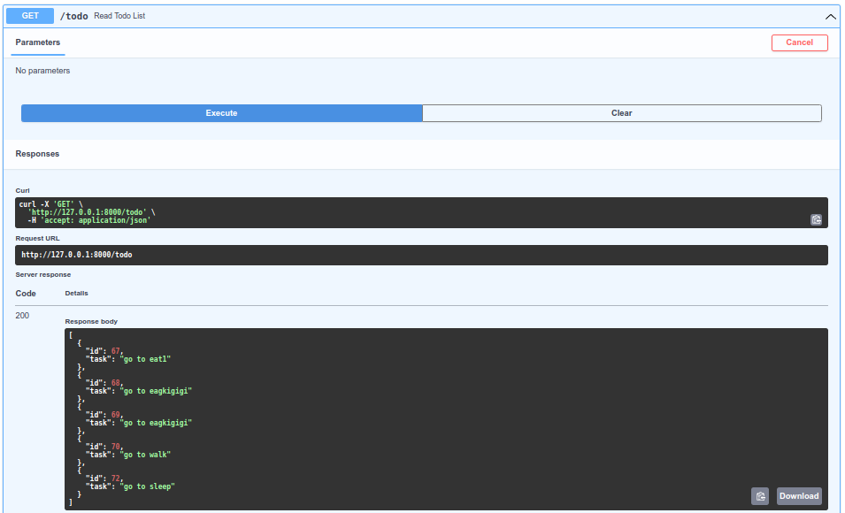
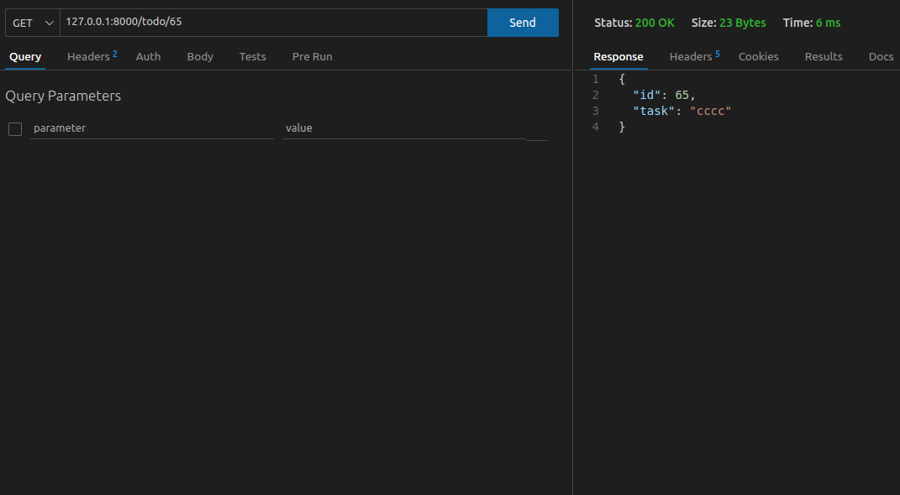
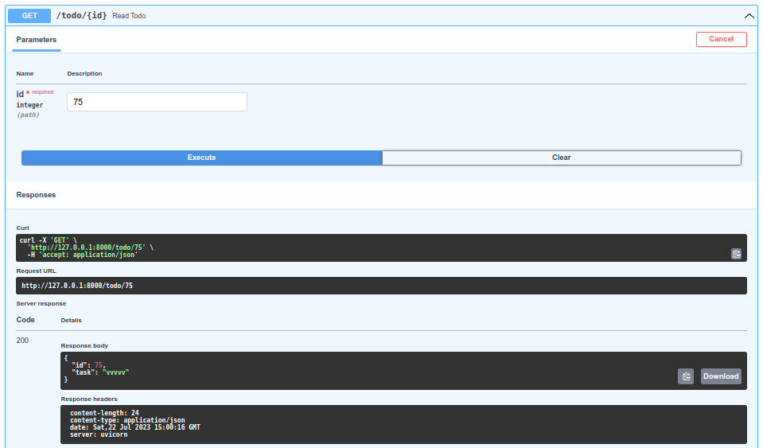
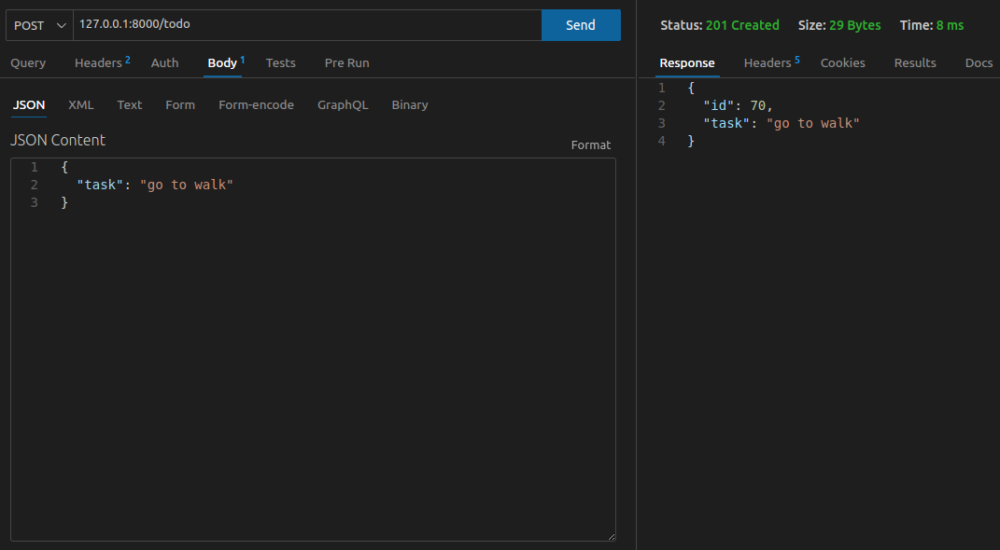
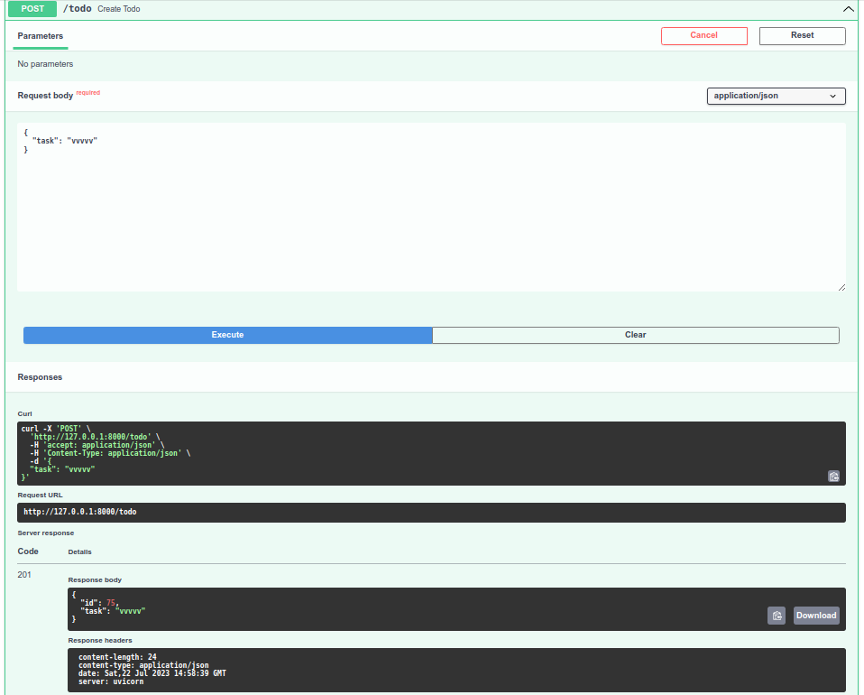
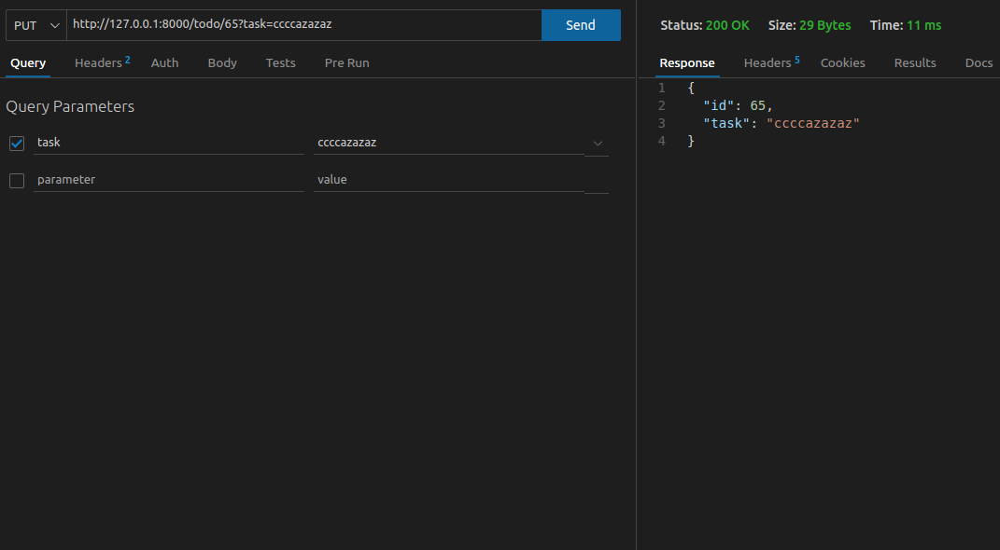
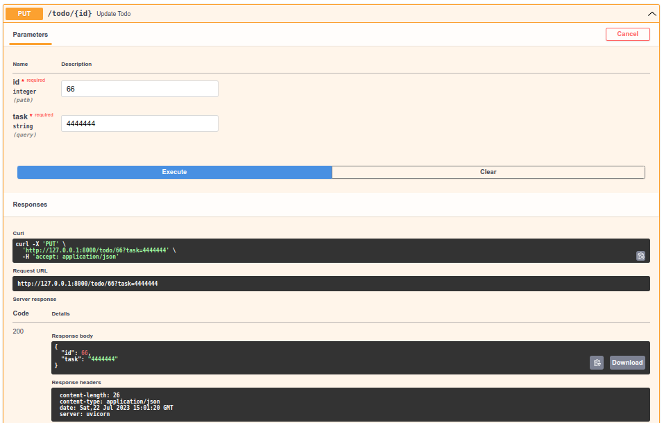
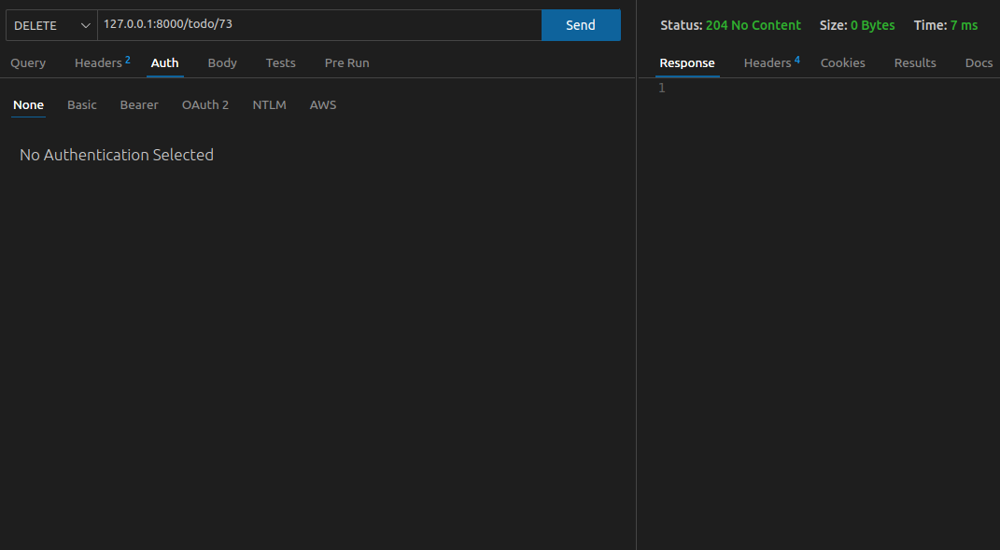
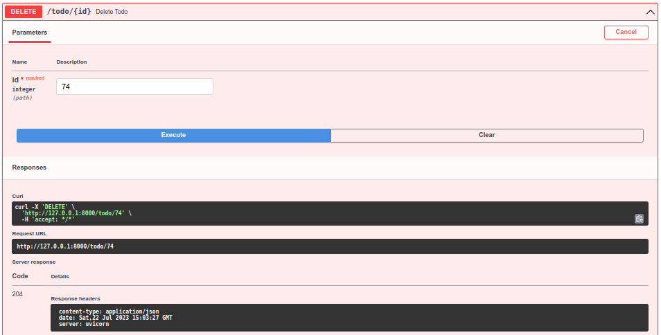

[](https://github.com/morheus9/fastapi_postgres_crud/actions/workflows/ruff.yml)
[](https://github.com/morheus9/fastapi_postgres_crud/actions/workflows/pylint.yml)
[](https://github.com/morheus9/fastapi_postgres_crud/actions/workflows/push_dockerfile.yml)
# This is base CRUD server with postgres and FastApi:
## Just clone, go to /infra and do:
```
cd infra
docker compose up --build
```
## URLs
```
App:          http://127.0.0.1:8000
Docs fastapi: http://127.0.0.1:8000/docs
BD:           http://127.0.0.1:5432
Pg Admin:     http://127.0.0.1:5000
```
### You can make CRUD requests. For example:

- GET All




- GET By ID




- POST




- PUT




- DELETE


